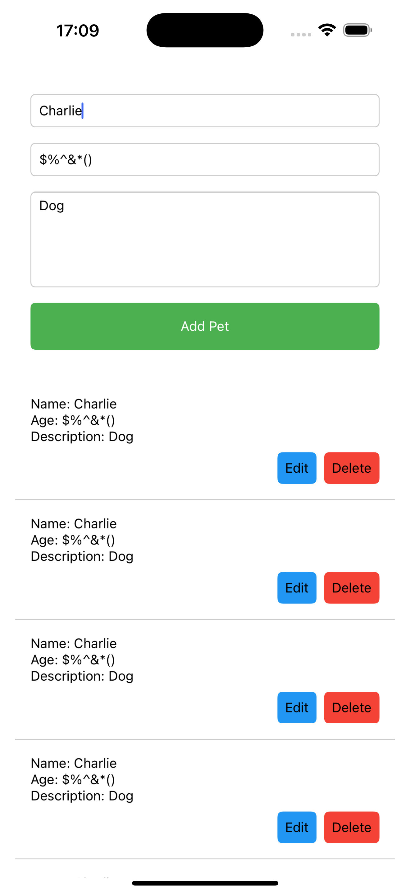

# Pet Manager App

A React Native application for managing pets, built with Expo.

## Setup

Please refer to the [SETUP.md](./SETUP.md) file for detailed instructions on how to set up the project.

# Technical Challenge:

- There are several bugs in the app that need to be fixed.
- Additionally, there are several features that are not implemented.
- Please write clean structured and maintainable code. Refactor existing code if needed.
- You are free to improve the UI/UX and use any externallibraries (icons, components, etc.) you see fit.

> Note: You do not need to implement the bonus features to complete this challenge.

> Note2: You don't have to separately implement for Android and iOS.

## Known Issues

The app contains several intentional bugs that need to be fixed.
Here is screenshot of the app:

1. Pet Management Issues:

   - Adding new pets doesn't preserve existing pets
   - Updating pets doesn't work correctly
   - Delete functionality is broken
   - Duplicate pet names allowed

2. Form Validation:

   - No validation for empty fields
   - Age field accepts invalid inputs

3. Typescript:
   - There are some typescript errors and ignores in the code
   - Make sure to fix them

## Features to Implement

1. Search Functionality:

   - Add ability to search pets by name
   - Implement filtering options

2. Data Persistence:

   - Implement local storage to persist pets data
   - Handle app restart scenarios

3. Pet Photo Upload:

   - Add ability to upload pet photos

4. Testing:
   - Add unit tests for form validation
   - Test pet CRUD operations

## Bonus Features (Optional)

1. Add Pet Category (Dog, Cat, Bird, etc.)
2. Add Pet Breed
3. Add Authentication (Login, Register) connected to test Firebase backend

## Evaluation Criteria

- All bugs found and fixed - 10 points
- Code is clean and readable, well organized - 10 points
- All requested bonus features implemented - 10 points
- Testing coverage - 10 points
- Bonus features implemented - 10 points

## Deliverables

- Push your changes to your github repository.
- Send a link to your repository to Hiring Manager
- Optionally you can send ZIP file with your changes.
